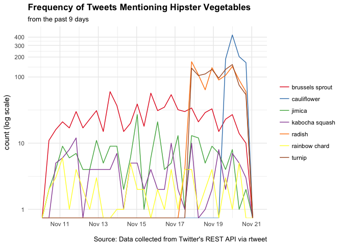

hipster-veggies
===============

Find Select Trending Vegetables from Twitter :carrot:


Analysis
--------

Going to use the `rtweet` library and some assorted `tidyverse` things.

``` r
library(rtweet) # devtools::install_github("mkearney/rtweet")
library(tidyverse)

# I persisted these credientials in my ~/.Rprofile
twitter_token <- create_token(
app = Sys.getenv("appname"),
consumer_key = Sys.getenv("twitter_key"),
consumer_secret = Sys.getenv("twitter_secret"))
```

Searching for the top most recent tweets for each vegetable from the article: [7 Hipster Vegetables Most Likely to Dethrone Kale](https://spoonuniversity.com/lifestyle/7-hipster-vegetables-most-likely-to-dethrone-kale). The documentation for the query arguement to search for more words by using the 'OR' operator did not work, so multiple searches we ran.

``` r

radish_tweets <- search_tweets(q="radish", 
                               n = 1000, 
                               include_rts = FALSE, retryonratelimit = TRUE, lang = "en") 

cauliflower_tweets <- search_tweets(q="cauliflower", 
                                    n = 1000, 
                                    include_rts = FALSE, retryonratelimit = TRUE, lang = "en")

turnip_tweets <- search_tweets(q="turnip", 
                                    n = 1000, 
                                    include_rts = FALSE, retryonratelimit = TRUE, lang = "en")

jimica_tweets <- search_tweets(q="jicama", 
                                    n = 1000, 
                                    include_rts = FALSE, retryonratelimit = TRUE, lang = "en")

rc_tweets <- search_tweets(q="rainbow chard", 
                               n = 1000, 
                               include_rts = FALSE, retryonratelimit = TRUE, lang = "en") 


bs_tweets <- search_tweets(q="brussels sprout", 
                                    n = 1000, 
                                    include_rts = FALSE, retryonratelimit = TRUE, lang = "en") 


ks_tweets <- search_tweets(q="kabocha squash", 
                                    n = 1000, 
                                    include_rts = FALSE, retryonratelimit = TRUE, lang = "en")

#ks_tweets <- dplyr::filter(ks_tweets, lang == "en")
```

A preview of tweets about rainbow chard.

``` r
head(rc_tweets$text)
#> [1] "Beautiful linleyvalleypork \U0001f437 in @jamieoliver recipe for Chickpea Chard Pork, no rainbow chard so… https://t.co/0HQ7pz4z5R"                                                      
#> [2] "Sprouting butternut, rainbow chard, bok choi, pepino #Permaculture #foodswap #vegetable #seedling waiting for chinese chives &amp; artichoke to get a wriggle on https://t.co/wqRvVTyI8w"
#> [3] "@rnussbaum11 Give chard a second chance!!!! ESP rainbow chard!!! It’s so pretty!"                                                                                                        
#> [4] "@rnussbaum11 Also VERY good w rainbow chard too bc w the chard you chop up the stems like celery and sauté those too and it’s sooooooooo good"                                           
#> [5] "So these are the stems of rainbow chard, cooking in beef stock and bacon fat because.. well..… https://t.co/aJVaZwwhMZ"                                                                  
#> [6] "Garden just provided some rainbow chard for lunch \U0001f957♥️\U0001f60a #love #santafe #photo #moments https://t.co/7Pcm6A3H3p"
```

Let's combine these data sets into one for graphing while preserving the original vegetable type by creating an additional column.

``` r
bs_tweets$vegetable <- "brussels sprout"
cauliflower_tweets$vegetable <- "cauliflower"
jimica_tweets$vegetable <- "jimica"
ks_tweets$vegetable <- "kabocha squash"
radish_tweets$vegetable <- "radish"
rc_tweets$vegetable <- "rainbow chard"
turnip_tweets$vegetable <- "turnip"

all_veggies <- rbind(bs_tweets, cauliflower_tweets, jimica_tweets, ks_tweets, radish_tweets, rc_tweets, turnip_tweets)
```

``` r
gg_veggies <- all_veggies %>%  group_by(created_at, vegetable) %>% 
                  summarise(n = n() ) %>% 
            ggplot(., aes(x = created_at)) +
                geom_freqpoly(aes(color = vegetable)) +
                scale_color_brewer(palette = "Set1") +
                theme_minimal() +
                theme(plot.title = element_text(face = "bold"), legend.title = element_blank()) +
                labs( x = NULL, y = "count (log scale)", title = "Frequency of Tweets Mentioning Hipster Vegetables", subtitle = "from the past 9 days", caption = "\nSource: Data collected from Twitter's REST API via rtweet"
  ) + scale_y_log10(breaks = c(1, 10, 100, 200, 300, 400))

gg_veggies
```



fin :tada:

Extra
-----

*Here are some other articles about **Hipster** Vegetables*:

1.  [The 22 Most Hipster Foods On The Planet - HuffPost](https://www.huffingtonpost.com/2014/04/15/hipster-food_n_5146632.html)

2.  [What Will Be the Next Hipster Vegetable?](https://www.pastemagazine.com/articles/2015/09/what-will-be-the-next-hipster-vegetable.html)

Contact Me
----------

Jasmine Dumas | \[@jasdumas\](<https://twitter.com/jasdumas>) | [jasdumas.github.io](http://jasdumas.github.io/)
